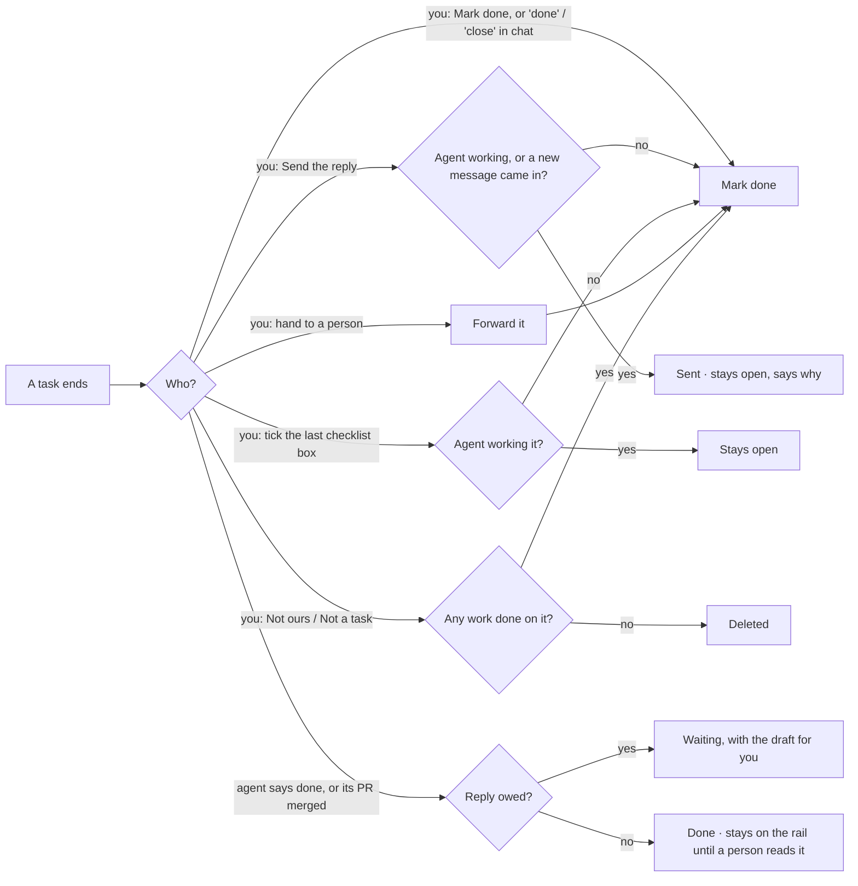

# How a task ends

Every way a task can end, and exactly what happens. If you are about to add a button, an
Assistant verb or an automation that finishes a task, it goes through one of the roads below.
Do not add a new one.

Decided with the owner on 2026-09-24, after a trace found about fifteen separate places that
closed a task. Each did its own part of the clean-up, so the same "it didn't close" and "a
closed task still shows" bugs kept coming back.

## The one close: Mark done

There is one close, `concierge.close_task`, and one word for it everywhere: **Mark done**. It
always does all five of these:

1. the task's status becomes `done`
2. any draft waiting for your yes is retired (it stays on the task, unsent)
3. a live agent session on the task is stopped
4. the item leaves the work rail
5. the "yours to end" mark comes off (see below)

## Decision tree

## The doors

| You do | What happens | Code |
|---|---|---|
| **Mark done**: the task page, the Assistant's button or card, "done" or "close" typed or said in chat, the phone | Mark done | `concierge.close_task`; `server` operations `task.complete` and `item.settle`; the task `PATCH` |
| **Send the reply** | Sends, then Mark done. It stays open (with a comment saying why) while an agent is actively working it, or if a new message arrived on the task after the one you answered. | `verdicts._settle_task_after_sent_reply` |
| **Tick the last checklist box** | Mark done, unless an agent is actively working it | `server.tick_checklist` |
| **Hand to a person** | Forwards, then Mark done | `server` hand-off endpoint |
| **Not ours / Not a task** | Deleted when nothing was done on it; otherwise Mark done | `server._file_task` |
| **Close without sending** (a channel that can't send) | Mark done | `verdicts.decide` (`close_unsent`) |

| An agent does | What happens | Code |
|---|---|---|
| Says it is done (`taskuary --done`) | The session is written up. If a reply is owed, the task **waits** for you with the draft; otherwise it is done. | `selfclose.declare` → `coder.wrap` → `coder.finish` |
| Its pull request is merged or closed | Same as above | `channels.close_upstream_ended` |

## Rules that follow from this

- **Never seen by a person stays on the work rail.** A task an agent or a merged PR closed stays
  on the rail, however long ago, until someone reads it (`processing_unread._agent_finished`).
  Agents may open and close tasks; they may not make one silently disappear.
- **A quiet screen is not an ending.** There is no longer a judge that reads a stopped session
  and guesses it finished (`selfclose.on_stop` closes nothing). Only the agent saying so, or you,
  ends a task.
- **"Yours to end".** When you start or continue a session on a task yourself, the task is quietly
  marked `stay:open`. It means one thing now: the agent's seed tells it not to run `--done`, because
  you'll end it. None of your own actions look at the mark, and Mark done removes it.

## Not endings

These never close a task:

- **Save and end session**: stops the agent and writes its report; the task stays open.
- **Reject** a draft: the draft is rejected; the task is untouched.
- **Next** and **Tomorrow**: they move the walk.

## Removed

These existed until 0.3.6.9 and were taken out because they closed tasks behind every other rule:

- dragging a card between Board columns
- the Wall's "Wrap up task" button
- the "No reply needed" button (Mark done is that)
- the quiet-screen judge
- the labels "Close the task", "Close without sending" and "Mark task done" (all Mark done now)
