The Assistant walks you through what is waiting: one card at a time, with a few buttons under it.
There are eight buttons in all. Anything without a button still works when you ask for it in your own
words, in the app or on your phone.

## The buttons on each card

| Button | Shown on | What it does | Runs |
|---|---|---|---|
| **Next** | every card | Marks it read and moves on. Open work you pass comes back after a few hours (Settings → Passed work comes back after) | at once |
| **Mark done** | a draft reply, a finished agent, a task | The one close: the task is done, an unsent draft is retired, a live agent is stopped, and it leaves your rail | at once |
| **Send** | a draft reply | Sends the draft, then Mark done | you confirm |
| **Run it** | an agent's proposal | Runs the action the agent proposed | you confirm |
| **Reply** | a person's ask, a finished agent with no draft | Writes a draft reply. Nothing is sent | at once |
| **Make a task** | an ask, an fyi, an idea | A task on your own list. No agent starts | you confirm |
| **Send to agent** | an ask, an fyi, an idea, a meeting, a report | A task and an agent on it. The card asks which agent | you confirm |
| **Not ours** | a draft reply, a proposal, an ask, an fyi | Files it. The card asks how far | you confirm |
| **Save and end session** | an agent waiting on you | Writes up what the session did and stops the agent. The task stays open | at once |

A handful of fyi comes as one card with its own **All read, next** button.

## The two buttons that ask one question

| Button | Answer | What happens |
|---|---|---|
| **Not ours** | Just this once | This message is filed. Its task is deleted if nothing was done on it, otherwise marked done |
| | From now on | Triage learns to file everything from this sender. Their mail still arrives and stays readable |
| | A rule in Settings | An exclusion rule: their mail never reaches triage, and what already arrived leaves the Timeline. Reversible |
| **Send to agent** | A coding agent | A task and a coding agent in a repository. The card asks which repository when it is not clear |
| | A non-coding agent | A task and an agent for reading, checking, drafting or research |

Send to agent starts on the agent triage would pick; the other is one click away on the card.

## Remind me

Every open task has **Remind me** on its page: tomorrow, next week, in 2 weeks, in a month, or any day
from the calendar. Until that day the task is under **Upcoming** in Tasks and off your work rail. That
morning a note goes on the task and it is back on your rail, however long ago it arrived. Ask the
Assistant the same thing — "bring TQ-0123 back in two weeks" — and it does it at once, with an undo.

## Words that work typed

These have no button. Say them, in the app or on your phone.

| Say | What happens | Runs |
|---|---|---|
| "reply and tell them…" | A draft with that gist, for your yes | at once |
| "redraft it shorter" | The draft written again with the change | at once |
| "yes, go ahead" to a waiting agent | Your answer goes to the agent | you confirm |
| "run it again" on a report | The report runs again | at once |
| "split it in two" | Two tasks from one arrival | you confirm |
| "remember that…" | A fact kept in Settings → Memory, used by triage and the Assistant | you confirm |
| "clear all the fyi" | Clears that set from the walk, with the count on the card | you confirm |
| "set up a report that…" | A walk-through for a report, connection or workflow | you confirm |
| "forward it to Erin" | A hand-off drafted for your yes | you confirm |
| "stop the agent on TQ-0123" | Saves and ends that agent's session | at once |
| "turn auto-drafts off" | The setting is changed, with an undo | at once |
| "what's waiting on me?" | Looked up and answered — tasks, reports, mail, calendar, settings | at once |

Later and Tomorrow are gone: **Next** is the "not now", and a date is the task's **Remind me**.
