A task in Taskuary is three records, not one: the durable job, the agent work done on it, and the
reply to whoever asked. They start and finish independently, and keeping them apart is what stops
the word "done" meaning three different things.

## A task's three lives

The task page shows them as one numbered workflow — **1 Task → 2 Agent work → 3 Reply** — and
each stage owns exactly one state badge.

| Part | What it records | Main controls | What it never does by itself |
|---|---|---|---|
| **Task** | The durable job and who owns it | owner, kind, priority, status, Reopen, Mark done | Starting or ending an agent session does not complete it |
| **Agent work** | One or more attempts by a coding or non-coding agent, plus the saved result | harness, model, new prompt, start, prompt, pause, finish, stop | Stopping does not mark the task done or send a reply |
| **Reply** | Communication with the person who asked | write, generate, edit, approve and send | Sending it marks the task done — unless an agent is still working or a new message came in |

While a terminal or an assistant chat is live, the task collapses to a one-line context strip and
the workspace takes most of the page. Full controls, saved results and restart choices come back
when the agent stops.

### Who is allowed to close it

- **You** end a task with **Mark done**. Every way of saying it — the button, the Assistant's card,
  "done" or "close" in the chat, the phone — does the same thing: the task is done, any unsent
  draft is kept but retired, a live agent is stopped, and it leaves your work rail.
- **Sending the reply** marks the task done, unless an agent is still working on it or a new
  message came in while you were answering — then it stays open and says why.
- **Ticking the last checklist box** marks it done, unless an agent is working on it.
- **An agent** may say it is finished (`taskuary --done`). Taskuary saves the result, and either
  waits for you with a drafted reply or marks the task done. A task an agent closed stays on your
  work rail until you have read it. A session you started yourself tells the agent to leave the
  ending to you.
- A stopped or quiet session never ends a task on its own.

Reopening a completed task starts a fresh task lifecycle rather than pretending an old terminal
is still alive.

## Sending work to a coding agent

Open **Agent work**, choose the CLI and model, and start. The session is handed the task summary,
the incoming messages, the attachments, any saved result from an earlier run and your optional
new prompt — plus a context file under `~/.taskuary/context/` holding the thread, relevant sender
and topic history, the learned profile, and reports from related closed tasks.

| Control | What it does |
|---|---|
| **Start coding session** | Starts the selected harness and model |
| **Start new coding session** | Picks a different harness after an earlier run stopped or hit a limit; the checkout and history are kept |
| **Give new prompt** | Queues another instruction for the live session |
| **Pause & save** | Ends the session after writing a handoff note for the next one |
| **Save and end session** | Ends the session and writes its result; the task stays open until you mark it done |
| **Stop session** | Ends only the process. Deliberately changes neither task nor reply state |

**Mark done** is stronger than all of them: it closes the task *and* ends any live session,
because a finished task should not leave an orphan process running.

The saved result is deliberately short. Every finished coding session also writes a full Markdown
artifact with that result and the complete transcript — **Work details → Full artifact** on the
task page.

### When the agent opens a browser

With the optional `agent-browser` tool installed, the page the agent is on appears live beside
the terminal. **Take over** hands you the mouse and keyboard for a password or a 2FA code the
agent must never type; **Snapshot** keeps the frame on the task as an attachment. On the Wall, a
narrow tile shows a "browser" chip that opens the page over the session.

## The general agent

Not every job is code. A `general` task opens a conversation instead of a terminal: research,
planning, writing, weighing an option, working out what to ask. No system is touched.

You reach it from **Talk it through** on a Timeline row, from ＋ New → *Give an agent a job* →
**Just talk it through**, or from *Prepare me for it* on a calendar invite.

General chats save their provider, model and native conversation id across restarts. Claude and
Codex resume that exact conversation when it still exists and the provider configuration matches;
otherwise the assistant continues from Taskuary's own saved history and says so.

## Sessions and transcripts

**Continue previous work** on the Assistant page lists unfinished tasks that have saved agent
work, each with an excerpt of the latest reply or handover. **Resume** opens the task and carries
on; **Review draft** opens a pending result. Loading the page starts nothing, and a session
already running is opened rather than duplicated.

Reopening a pane seeds it from a render of the session, not from raw bytes, so a pane you come
back to shows what the screen actually looked like.

## Several agents in one repository

Taskuary can run more than one coding session against a shared checkout, and spends real effort
on not letting them collide:

- **Affinity routing** asks whether a queued task is likely to touch the same files as a running
  one. Likely overlap waits, and starts by itself when the first session ends.
- **Tell the agent** queues your notes until the CLI is back at its prompt, so a note never lands
  mid-turn or on top of a question waiting for you. Lists drip in one item per stop; pasted
  screenshots are saved locally and named in the note.
- **The blackboard** shows what each session has actually modified, computed from Git and the run
  trace rather than from what the agent said it would do. A new agent is handed that picture at
  startup.
- **First in has control.** The newcomer is told which files belong to another session and must
  not edit, revert, stash or commit them.

**Live handoffs** on the Board shows what each agent is working on, what is blocked and what is
ready for someone else, with read markers for which agents have seen each note. The **Hub** is
the longer-lived version of the same idea: discoveries and decisions by topic, so knowledge
outlives the job that produced it.

## Checklists and closing

A task can carry a checklist. Ticking the last box marks the task done, because there is nothing
left it was waiting for, unless an agent is still working on it. Closing a task ticks every remaining box, for the same
reason in reverse — a closed task with open items is a lie about its own state.

## Replies

The Reply section exists whenever the task has an incoming sender. It shows one of three things:
no draft yet, a draft ready, or a reply sent. **Open on the task** is the only road out — type your
own or generate one, edit it, approve it.

One reply is special. A **clarification** stops the active agent when it is sent and moves the
task to waiting, because an external answer is now required. An ordinary reply from an
owner-controlled task is just an update: it leaves both the task status and any useful session
alone.

## Profiles and playbooks

Two levels, and the difference is worth holding onto:

- A **profile** is a worker — which CLI, which model, which flags. Install one from a skill or
  configure it on the connector card.
- A **playbook** is a job — when it starts, which connections it uses, the steps, what an agent
  may do alone, what to ask first, and what counts as done.

`CODER.md` is the playbook for code. Every other kind of recurring job gets its own page the
first time an agent does it: on close, Taskuary asks whether that will recur and drafts the
playbook onto the task. Approve it, and the next message like it is matched to that playbook by
triage, and the agent is seeded from it instead of from `CODER.md`'s repository rules.

Each connector card lists the playbooks that name it, and the words themselves are edited on the
**Docs** tab.

## How work is ordered

Each inbound connector chooses how the tasks it creates reach agents:

- **One by one** dispatches in arrival order; when every slot is busy, tasks wait first in, first
  out.
- **Ranked together** orders a shared queue by value and runs only the top tasks. New work
  reranks the queue rather than joining the end of it.

Ranked value starts from deterministic evidence — were you addressed directly, how many people
were on it, has someone already answered, urgency, who wrote it — and the triage brain adds a
short comparative reason when several tasks are waiting. Waiting tasks gain value over time, so
the bottom of the queue cannot starve.

The Timeline and the Board show the same order. **Start now** pins a task to the top; **Later**
moves it down without deleting it.
